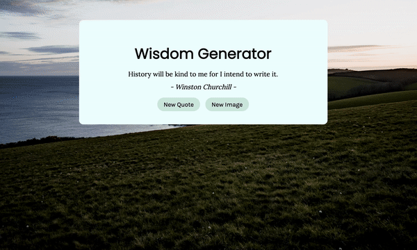

# quote-generator-javascript
a random quote generator built with HTML/CSS/JavaScript

## What I did
I wanted to further my vanilla javascript knowledge, so I decided to create a **random quote generator**! 

### Learning Outcomes
- [X] practice using an API 
- [X] practice HTML & CSS styling

## What I learned
- Figuring out how to use the **quotes API** wasn't as hard as I thought it would be, so I thought I would challenge myself by trying to generate random background images using the **Unsplash API**
- I had some trouble figuring out how to 'fetch' the data from the Unsplash API as I couldn't figure out what URL to use and the syntax for specifying parameters. It took a while but I was able to do it! My current parameters are 'nature wallpaper' and 'landscape orientation'
- At one point the button to generate a new image stopped working and I was so confused, until I realized that the API allows for only 50 requests an hour...

### The Wisdom Generator Features
- button to generate a new quote (from the API quotable)
- button to generate a different background image (thanks Unsplash!)

